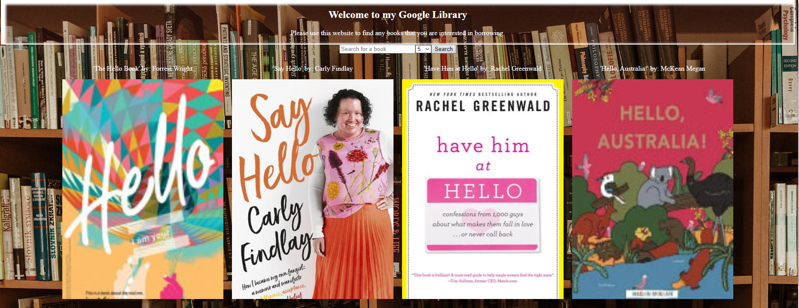

# Google Books API website - An eLibrary

## Demo & Snippets

- 

---

## Requirements / Purpose

### Outline:

- This project will require you to use both DOM manipulation and Asynchronous programming. The aim is for the user to be able to search for a book inside the Google Books database and to be able to get more details about a certain title.

### MVP's:

- Create a page that allows users to search for books Page should include the following:

  - Header section introducing the page

  - Form containing a text input and a submit / search button

  - A grid of books Instructions:

  - When the submit button is clicked you need the request books from the Google books API using the input value as your query string

  - The books that you receive should be rendered in the books grid.

  - Each book in the grid should have an image, author, title and description

  - The grid should be responsive on different screen sizes

  - You should use async / await for your request code. You can choose how to handle the code in component

- Styling (required):

  - This application should look good, take some time to pick a palette and plan out your design. You can use tools like Figma or wireframe pro to plan what your application is going to look like. Styling must use BEM, and each block should have its own SCSS file Your palette should use variables

Application Design (required):

- Seperate request code from components
- functions should do 1 thing, and should be as pure and reusable as possible
- Think about how you might "clean" the data
- Always use iterators over loops
- Always parametrize and abstract large pieces of duplicate code.
- Presentational components should be as dumb as possible

---

## Build Steps

- npm run build OR npm run dev

---

## Design Goals / Approach

- I wanted to make a simplistic, good-looking eLibrary that uses the Google Books API. A comfy feeling for checking books out, and an easy way to read the bio's. I first designed the barebones of the website, the layout of the card its components. After this, I looked into the Google Books API and how to use it. I spent some time setting this up, and allowing it to work with a search bar. After this, I finished up with more design choices, like what data I wanted to display and how to display it.
- Breaking this down helped a lot, I could get some basic aesthetic/design choices out of the way earlier so I could focus on the proper programming/functionality of the API. Once that was done, I finished up with some more complex design choices. This allowed me to focus on the individual parts of the website, allowing me to better develop those parts as opposed to jumping all over the place.

---

## Features

- A search bar that searches for books
- A value for how many books to search for
- On hovering of a book, give the description

---

## Known issues

- Sometimes hovering can be a bit buggy, and either needs to be hovered in a specific spot or it keeps resetting itself when hovered.

---

## Future Goals

- I would like to implement a link for this, if the user likes a book they can click it and it links you to either the eBook or a place to purchase the book.
- I would also like to implement a carousel, potentially an individual page for each book that also holds reviews, comments, etc.

---

## Change logs

### 21/11/2023 - Removed background colour

- Removed background colour of the card component to make it easier to read the text

---

## What did you struggle with?

- I struggled with the Google Books API at first, as I was getting a few errors when "searching" using this. A few fellow peers were also having this issue, and we all struggled with it for a day or two. After a lot of research, some of us had found a few different fixes and this helped the rest of us get this all working.

---
